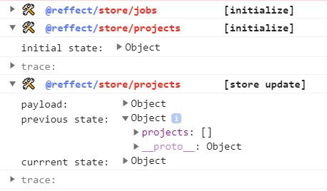

<div align="center">

[](https://github.com/acacode/reffect)  
[](https://www.npmjs.com/package/@reffect/logger)
[](https://bundlephobia.com/result?p=@reffect/logger)
[](https://github.com/acacode/reffect)

<div align="left">

Reffect — is a declarative and reactive multi-store state manager for JavaScript/TypeScript applications inspired by [Reatom](https://github.com/artalar/reatom) and [Effector](https://github.com/zerobias/effector)

# @reffect/logger

Store middleware for [`Reffect`](https://github.com/acacode/reffect)

## How to use

```ts
import { store } from "@reffect/core";
import { logger } from "@reffect/logger";

const projectsStore = store({ projects: [] }, "projects", [logger]);

// ...
```

## How it looks


